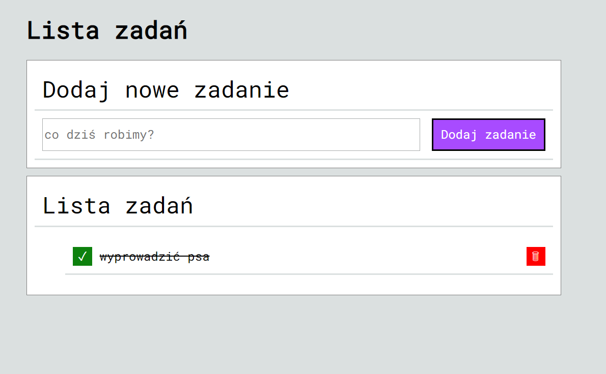

<h1>Lista zadań </h1>

strona umożliwia dodawanie i uzuwanie nowych zadań do swojej listy. Można też zaznaczać czy się zrobiło dane zadanie bądź nie

Demo strony

https://michalgozdek.github.io/task-list/

  
Technologje użyte do stworzenia  strony
  <ul>    
<li>HTML</li>
<li>CSS</li>
<li>JS</li>
</ul>
